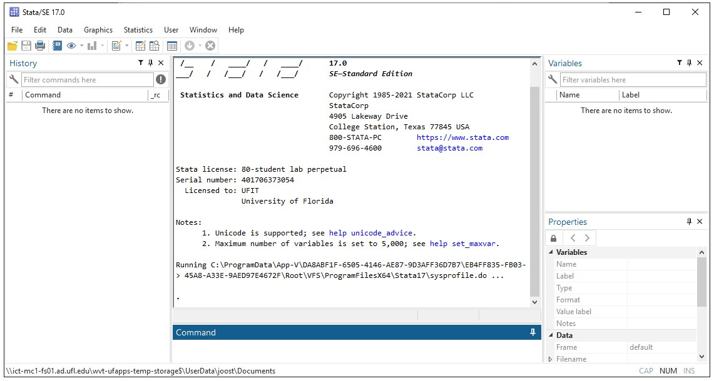
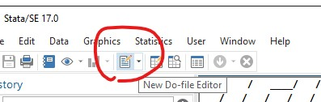
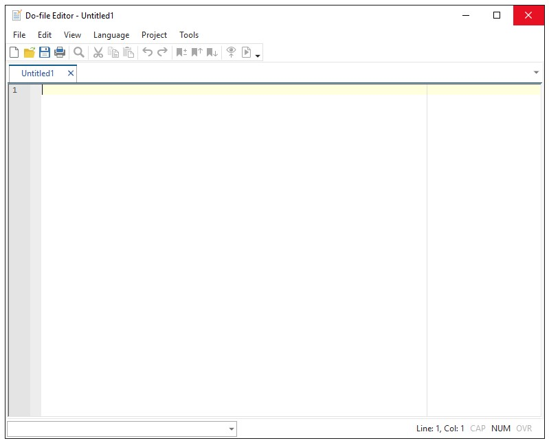
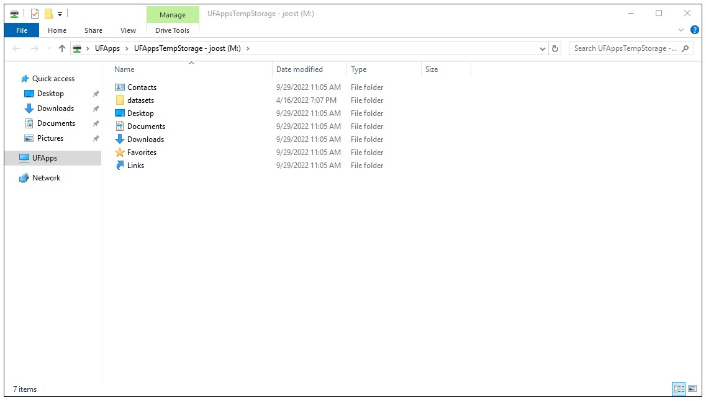
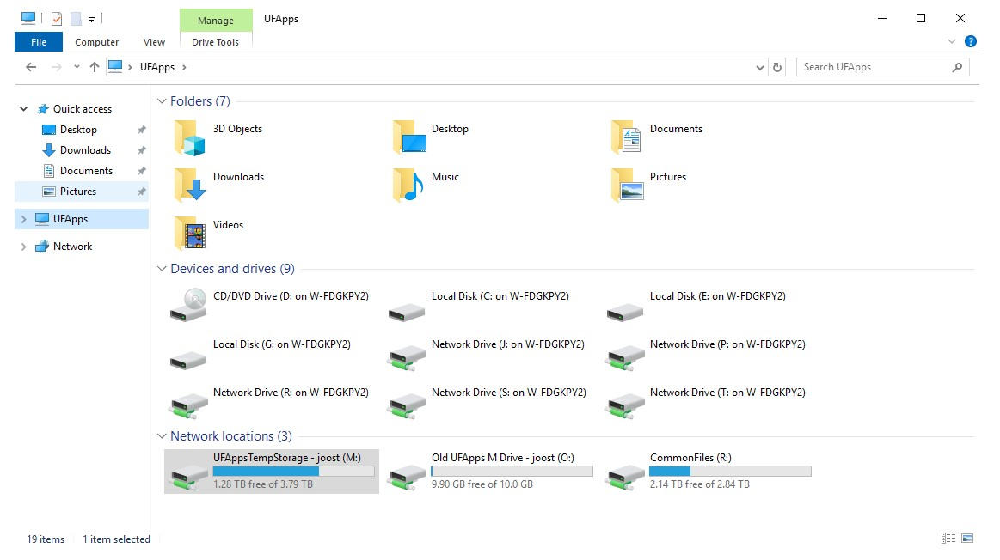

# Stata

Stata is a general-purpose statistical software package for data manipulation, visualization, statistics (and reporting).

Stata has its own programming language, but since version 16 Stata supports python.

## Stata on UF Apps

To use Stata on UF apps, go to (https://login.apps.ufl.edu/)[https://login.apps.ufl.edu/] and search for 'Stata' (use the magnifying glass in the upper right corner). You need to be on UF's VPN to access UF Apps.

> Note: if you use the 'light' version of Citrix you won't be able to access the files on your computer (only access files on the M-drive).

## Stata interface

Stata's interface has 4 main parts:

### Command line

Type commands in the lower bottom of the middle panel. This is helpful for trial and error.

### History

Each command that runs will be added to the left panel. You can click on any commands here and they will display in the command line where you can resubmit or edit these.

### Variables

Information on the dataset/variables is in the right panel.

### Log

The log is in the middle panel (above the command line). Output, errors etc are displayed here.

### Do files

The command line can be used to explore/debug/test code. To run several commands in one go you can use the do-file editor. To launch the do file editor press Control+9 or click:

The do-file editor:

The do file editor can have several files open at the same time. 

## Moving files to/from Stata

Stata runs on UF Apps, which has its own environment (virtual machines). To move files to/from Stata, you can use the M-drive app.

### Using the M-Drive

On UF Apps, search for 'drive', and select 'M Drive'. By default it selects the M: drive.

When you click on 'UFApps' in the left panel, it will show the various drives it has access to. Unless you are using the light version this should include your hard disks.

You can now navigate into the available hard disks and 'copy'-'paste' files and folders. 

> 'Drag' and 'drop' does not work. (You cannot use another explorer window and drag files onto the M drive.)
